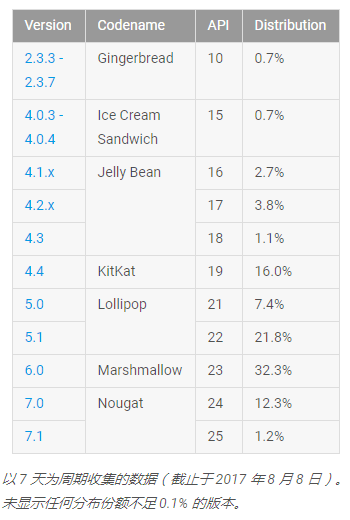
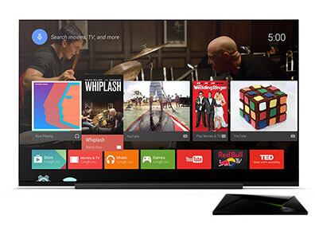
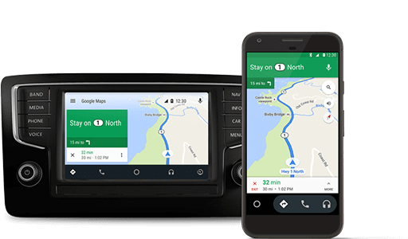
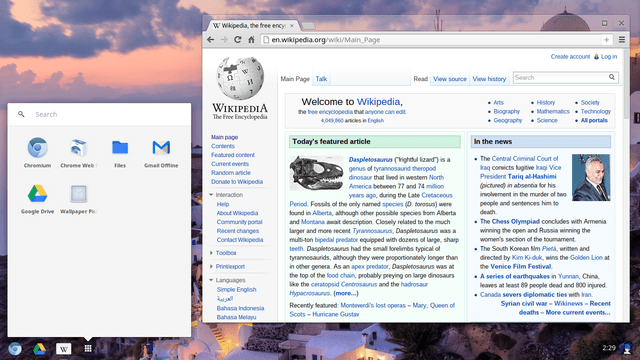
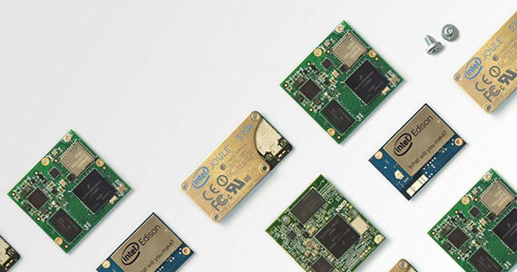

# Introduction - 入门

## 说在前面

由于官网并没有介绍 Android 的发展历史，故从维基百科、百度百科等多方位整理了一些东西，以便更好的认识 Android。

- Android 是一个基于 **Linux 内核**的**开放源代码移动操作系统**。
- Android 标志是一个全身绿色的机器人，颜色在 RGB 中十六进制代码为 **#A4C639**。
- 2003年10月，有“Android之父”之称的 **Andy Rubin** 等人创建了 Android 科技公司；2005年7月11日，Google 收购了 Android 科技公司；2007年11月，在 Google 的领导下，**开放手持设备联盟**（Open Handset Alliance） 成立。
- **2008年9月**，世界上第一款使用 Google Android 操作系统的商业性手机产品 **HTC G1** 推出，由美国运营商 T-Mobile USA 定制，HTC 代工生产。
- Google I/O 2017 开发者大会已经宣布，安卓月活跃设备已经达到**20亿**。

## 官网介绍

官方在首页的入门介绍主要分为六个部分：Android、Wear、TV、Auto、Chrome OS、Things。此处重点介绍 Android 部分，其余部分简单带过。

### Android

Android 操作系统的版本历史：

*注：此处记录的是那些有更新 API 的版本。*

- Android 1.0 - API 1
- Android 1.1 - API 2
- Android 1.5 - Cupcake 纸杯蛋糕 - API 3
- Android 1.6 - Donut 甜甜圈 - API 4
- Android 2.0, 2.0.1, 2.1 - Eclair 松饼 - API 5, 6, 7
- Android 2.2 - Froyo 冻酸奶 - API 8
- Android 2.3, 2.3.3 - Gingerbread 姜饼 - API 9, 10
- Android 3.0, 3.1, 3.2 - Honeycomb 蜂巢 - API 11, 12, 13
- Android 4.0, 4.0.3 - Ice Cream Sandwich 冰淇淋三明治 - API 14, 15
- Android 4.1, 4.2, 4.3 - Jelly Bean 果冻豆 - API 16, 17, 18
- Android 4.4, 4.4W - KitKat 奇巧 - API 19, 20
- Android 5.0, 5.1 - Lollipop 棒棒糖 - API 21, 22
- Android 6.0 - Marshmallow 棉花糖 - API 23
- Android 7.0, 7.1.1 - Nougat 牛轧糖 - API 24, 25
- Android 8.0 - Oreo 奥利奥 - API 26

Android 版本分布：

一些重要版本特性：

- 8.0 特性：通知、画中画、自动填充、自适应图标等。
- 7.0 特性：多窗口UI、直接回复通知、VR支持等；7.1 增加了应用快捷方式。
- 6.0 特性：运行时权限、指纹身份验证、低电耗模式和应用待机模式省电功能等。
- 5.0 特性：Material Design、ART运行时、支持64位架构、支持Android TV和Auto等，官方评价为**”迄今为止功能最丰富并且最富雄心的 Android 版本！“**；5.1 增加了多SIM卡支持。
- 4.4 特性：全屏模式、透明系统UI样式、NFC支付等；4.4W 增加Android Wear支持。

### Wear

Android Wear 将 Android 平台拓展至可穿戴设备，简洁、易懂、并且微互动。

### TV

Android TV 提供大屏幕的应用、游戏和内容，提升浏览效率。

### Auto

Android Auto 通过更大的触控目标，简化的界面和易于使用的语音操作，它旨在尽量减少分心，让您可以专注于道路上。

### Chrome OS

Chrome OS 是一个为上网本设计的轻量级开源操作系统。

### Things

Android Things 是 Google 面向物联网设备市场推出的系统。