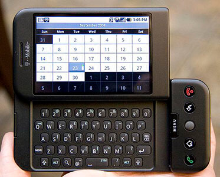
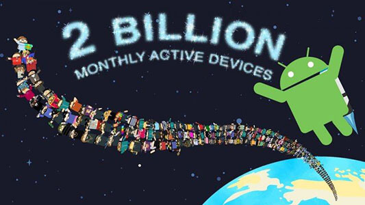
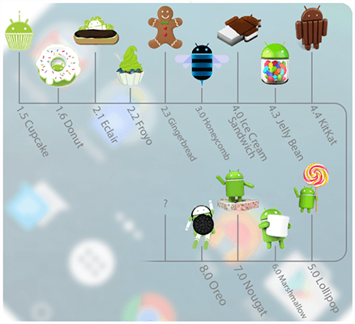
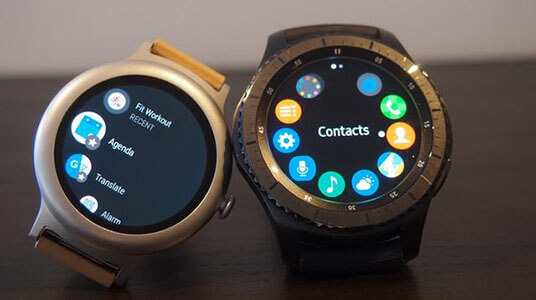

# Introduction - 入门

## 说在前面






由于官网并没有介绍 Android 的发展历史，故从维基百科、百度百科等多方位整理了一些东西，以便更好的认识 Android。

- Android 是一个基于 **Linux 内核**的**开放源代码移动操作系统**。
- Android 标志是一个全身绿色的机器人，颜色在 RGB 中十六进制代码为 **#A4C639**。
- 2003年10月，有“Android之父”之称的 **Andy Rubin** 等人创建了 Android 科技公司；2005年7月11日，Google 收购了 Android 科技公司；2007年11月，在 Google 的领导下，**开放手持设备联盟**（Open Handset Alliance） 成立。
- **2008年9月**，世界上第一款使用 Google Android 操作系统的商业性手机产品 **HTC G1** 推出，由美国运营商 T-Mobile USA 定制，HTC 代工生产。
- Google I/O 2017 开发者大会已经宣布，安卓月活跃设备已经达到**20亿**。


## 官网介绍

Android 作为一款操作系统，官方对其使用场景主要分为六个部分：Android、Wear、TV、Auto、Chrome OS、Things。

### Android



Android 操作系统的版本历史：

- Oreo - 奥利奥 - Android 8.0 - API 26


```

```

### Wear



Android Wear 将 Android 平台拓展至可穿戴设备，简洁、易懂、并且微互动。

Android Wear API 主要功能：同步通知，语音操作，开发可穿戴式设备应用，发送数据。

最新版本 Android Wear 2.0。

### TV

Android TV 